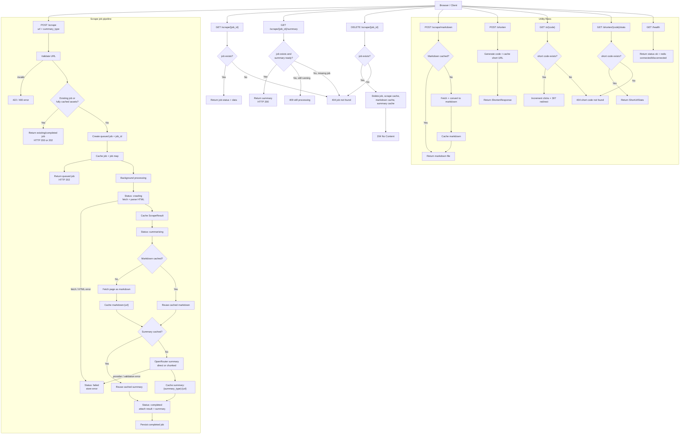

# Web Scraper Project Pipeline

This document reflects the current backend flow of the project after the move to a job-based scrape pipeline.

## Current Project Behavior

- FastAPI serves the frontend from `/`.
- `POST /scrape` creates or reuses a scrape job for a URL and summary type.
- `GET /scrape/{job_id}` returns job status and any available result data.
- `GET /scrape/{job_id}/summary` returns the AI summary when available.
- `DELETE /scrape/{job_id}` removes the job and its cached scrape, markdown, and summary data.
- `POST /scrape/markdown` returns cached or freshly generated markdown as a downloadable file.
- `POST /shorten`, `GET /s/{code}`, and `GET /shorten/{code}/stats` handle the URL-shortener flow.
- `GET /health` reports API health and Redis connectivity state.
- Redis is used when `REDIS_URL` is configured; otherwise the app falls back to in-memory cache with the same TTL behavior.

## Mermaid Flowchart

## Notes

- The primary user flow is now job-based rather than direct preview JSON.
- The same URL can reuse cached scrape results, markdown, and summaries across repeated requests.
- Summary caching is separated by `summary_type`, so `brief` and `detailed` are stored independently.
- Background processing updates job states through `queued`, `crawling`, `summarising`, `completed`, and `failed`.
- The delete endpoint currently removes both the job record and the cached assets tied to that URL and summary type.
