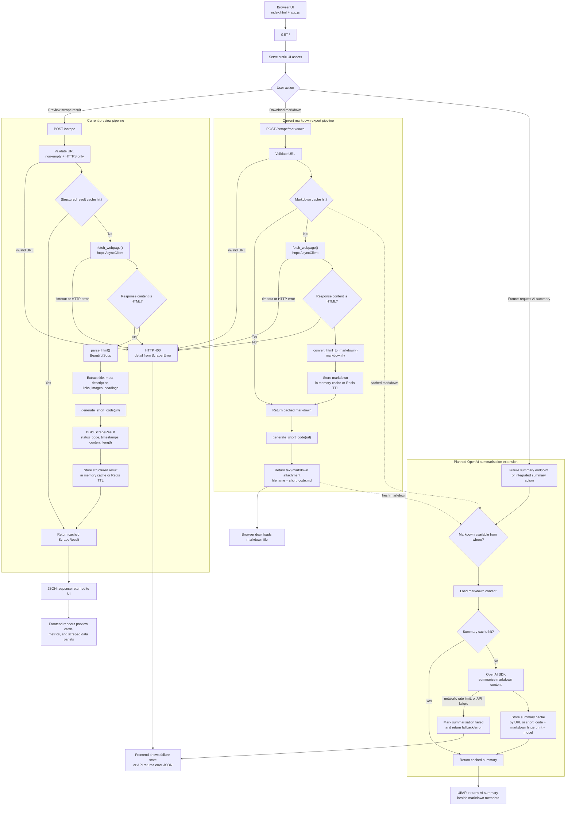

# Web Scraper Project Pipeline

This document reflects what the project currently does and shows how the planned OpenAI SDK summarisation step can fit into the existing flow.

## Current Project Behavior

- FastAPI serves the frontend from `/`.
- `POST /scrape` returns structured JSON for preview and uses cache.
- `POST /scrape/markdown` reads cached markdown first, otherwise fetches the page, converts HTML to markdown, stores it in cache, and returns a downloadable `.md` file.
- URL validation only allows non-empty `https://` URLs.
- Fetching is done with `httpx.AsyncClient(...)` and HTML parsing is done with BeautifulSoup.
- Structured scrape results are cached in memory or Redis with a TTL.
- Markdown content is cached in memory or Redis with a TTL using a dedicated `markdown:{url}` cache key.

## Planned AI Summarisation Concept

- After markdown is available, the app can summarise the markdown with the OpenAI SDK.
- The summary step should work with freshly generated markdown from a new scrape.
- The same step should also work with cached markdown if that file was already generated earlier.
- A summary cache can be added so repeated summary requests do not keep calling the OpenAI API for the same markdown content.

## Mermaid Flowchart

## Notes For Implementation

- The current UI already follows a preview-first flow: preview JSON first, then download markdown.
- `POST /scrape` and `POST /scrape/markdown` both use the cache layer now.
- Markdown cache entries are stored separately from preview JSON entries.
- A clean future extension is to add summary read/write cache next.
- Call OpenAI only after markdown is loaded from a fresh scrape or cache.
- Return both the markdown metadata and the generated summary.
